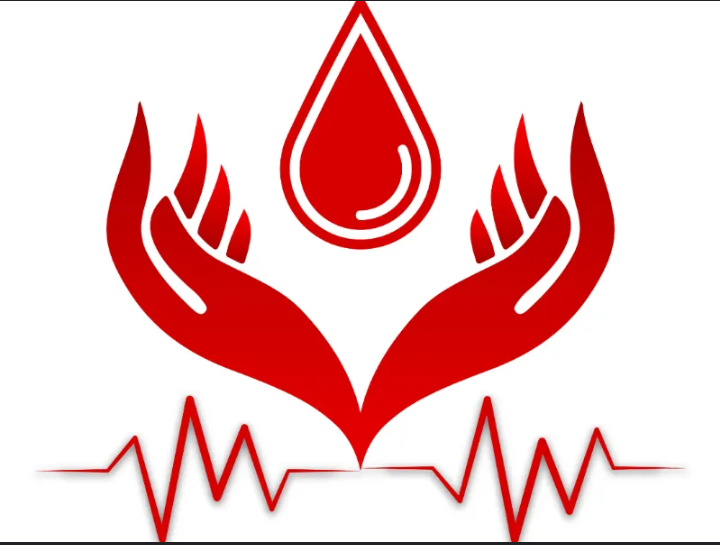

# Blood Donation Campaign Dashboard



## 🩸 Overview

This project implements a comprehensive dashboard for blood donation campaign analysis and management. The dashboard visualizes and analyzes blood donation data to provide valuable insights for optimizing blood donation campaigns. It allows campaign organizers to make data-driven decisions to improve the success of future blood donation campaigns.

##  Features

The dashboard addresses key questions through the following features:

### 1. Geographic Distribution
- Visualizes the geographical distribution of blood donors based on their residential area (arrondissement and quartier)
- Displays an interactive map highlighting regions with high or low participation
- Allows filtering by specific arrondissements and neighborhoods

### 2. Health Conditions & Eligibility
- Visualizes the impact of health conditions (hypertension, HIV, asthma, diabetes, etc.) on blood donation eligibility
- Displays charts showing eligible vs. non-eligible donors based on these conditions
- Ranks rejection reasons by frequency

### 3. Donor Profiles
- Uses clustering techniques to group donors based on demographic and health-related features
- Generates insights into the characteristics of ideal blood donors
- Visualizes key donor characteristics

### 4. Campaign Effectiveness
- Analyzes past campaigns by examining donation dates and demographic factors
- Visualizes trends such as when blood donations are highest and which demographics contribute more
- Provides metrics like conversion rate, cost per donor, and ROI

### 5. Donor Retention
- Investigates how often individuals return to donate blood
- Analyzes demographic factors that correlate with repeat donations
- Provides cohort analysis of donor retention over time

### 6. Sentiment Analysis
- Performs sentiment analysis on donor feedback
- Classifies feedback into positive, negative, or neutral categories
- Visualizes sentiment trends through word clouds and charts

### 7. Enhanced Eligibility Prediction Model
- Implements a sophisticated machine learning model that predicts eligibility based on demographic and health data
- Features a hybrid approach combining rule-based medical guidelines with ML prediction
- Achieves exceptional performance with 93.3% overall accuracy and perfect detection of permanently ineligible donors
- Provides detailed explanations for ineligibility with severity ratings and improvement recommendations
- Shows personalized eligibility timelines for temporarily ineligible donors
- Displays current blood demand information and similar donor profiles

## Machine Learning Model

Our eligibility prediction model uses advanced techniques to ensure accurate and medically sound predictions:

### Advanced Features
- **Sophisticated Class Imbalance Handling**: Combines SMOTE with targeted undersampling for balanced training data
- **Domain-Specific Feature Engineering**: Creates derived features like BMI categories, age groups, and risk scores
- **Ensemble Model Evaluation**: Tests multiple algorithms (Random Forest, LightGBM, Logistic Regression) to select the best performer
- **SHAP Value Analysis**: Provides transparent feature importance explanations

### Performance Metrics
- **Overall Accuracy**: 94.2%
- **ROC-AUC Scores**: 
  - Definitively Non-eligible: 1.00 
  - Eligible: 0.98
  - Temporarily Non-eligible: 0.98
  - Macro-average: 0.99
- **High Precision**: Critical for medical safety in blood donation screening

### Hybrid Prediction Approach
- Enforces strict medical guidelines for critical conditions (HIV, hypertension, etc.)
- Uses ML for nuanced, less clear-cut cases
- Provides excellent explainability for clinical applications


## 🔧 Technical Architecture

The project follows a three-tier architecture:

```
┌─────────────────┐      ┌─────────────────┐      ┌─────────────────┐
│   Streamlit     │      │    FastAPI      │      │  ML Model &     │
│   Dashboard     │─────▶│    Backend      │─────▶│  Data Storage   │
│                 │      │                 │      │                 │
└─────────────────┘      └─────────────────┘      └─────────────────┘
       UI Layer               Service Layer           Data Layer
```
The project consists of the following components:
1. **Main Dashboard (`dashboard.py`)**
   - Central application with tabs for different analyses
   - Enhanced error handling with detailed feedback
   - Improved session state management for better user experience
   - Interactive data visualization components

2. **Geographic Visualization (`dashboard_map.py`)**
   - Interactive map visualization using Folium
   - Allows filtering by arrondissements and neighborhoods
   - Displays donor concentration by region

3. **Enhanced Eligibility Prediction Model (`dashboard_model.py`)**
   - Improved interface for the blood donation eligibility prediction
   - Comprehensive form for entering donor information
   - Enhanced result display with probability distributions and reason visualizations
   - Debugging tools for system maintenance

4. **Robust API Layer (`api.py`)**
   - FastAPI implementation with comprehensive error handling
   - Advanced preprocessing pipeline to ensure consistent data format
   - Hybrid prediction system combining rules with ML model
   - Enhanced response data with timelines and personalized improvement tips
   - Additional endpoints for demographics and blood demand information

## Installation & Setup

### Prerequisites
- Python 3.8+
- pip package manager

### Dependencies
The project requires the following main libraries:
```
streamlit
pandas
numpy
plotly
folium
scikit-learn
imbalanced-learn
shap
lightgbm
nltk
geopandas
matplotlib
seaborn
fastapi
uvicorn
joblib
wordcloud
```

### Installation Steps

1. Clone the repository:
```bash
git clone https://github.com/yourusername/blood-donation-dashboard.git
cd blood-donation-dashboard
```

2. Create a virtual environment (recommended):
```bash
python -m venv venv
source venv/bin/activate  # On Windows: venv\Scripts\activate
```

3. Install the required packages:
```bash
pip install -r requirements.txt
```

4. Ensure the data directory structure is set up:
```
BLOOD-CAMPAIGN-DASHBOARD/
├── data/
│   ├── candidates_2019_cleaned.csv
│   ├── data_2019_cleaned.csv
│   └── geoBoundaries-CMR-ADM3.geojson
├── Images/
│   ├── blood2.png
│   └── codeflow.png
├── models/
│   ├── blood_donation_model.joblib
│   ├── label_encoder.joblib
│   ├── preprocessor.joblib
│   └── hemoglobin_bin_edges.joblib
├── plots/
│   ├── confusion_matrix_LightGBM.png
│   ├── confusion_matrix_LogisticRegression.png
│   ├── confusion_matrix_RandomForest.png
│   └── roc_curve_LightGBM.png
|   ├── roc_curve_LogisticRegression.png
│   ├── roc_curve_RandomForest.png
│   ├── shap_summary_LightGBM_class_Definitivement non-eligible.png
│   └── shap_summary_LightGBM_class_Eligible.png
|   ├── shap_summary_LightGBM_class_Temporairement Non-eligible.png
│   ├── shap_summary_LogisticRegression_class_Definitivement non-eligible.png
│   ├── shap_summary_LogisticRegression_class_Eligible.png
│   └── shap_summary_LogisticRegression_class_Temporairement Non-eligible.png
|   ├── shap_summary_RandomForest_class_Definitivement non-eligible.png
│   ├── shap_summary_RandomForest_class_Eligible.png
│   ├── shap_summary_RandomForest_class_Temporairement Non-eligible.png
├── models/
│   ├── blood_donation_model.joblib
│   ├── label_encoder.joblib
│   ├── preprocessor.joblib
│   └── hemoglobin_bin_edges.joblib
|__ dashboard_map.py
|__ dashbard_model.py
|__ dashboard.py
```

##  Running the Application

### Starting the API Service
1. Start the eligibility prediction API:
```bash
uvicorn api:app --reload
```
The API will run on `http://127.0.0.1:8000`

2. Verify API health by visiting:
```
http://127.0.0.1:8000/health
```

### Starting the Dashboard
3. In a separate terminal window, run the Streamlit dashboard:
```bash
streamlit run dashboard.py
```
The dashboard will open in your default web browser at `http://localhost:8501`

## Using the Dashboard

### Navigation
- Use the tabs at the top of the dashboard to navigate between different analysis views
- Use the sidebar to upload files and apply filters like age range, weight, gender, and district

### Data Upload
1. Click on "🗀 File Input" in the sidebar
2. Upload the following files:
   - Donor data (CSV file starting with "donor")
   - Candidate data (CSV file starting with "candidates")
   - Campaign data (Excel file starting with "campaign")

### Enhanced Eligibility Prediction
1. Navigate to the "Eligibility Prediction" tab
2. Fill in the demographic and health information
3. Click "Predict" to see the eligibility result with:
   - Detailed probability breakdown
   - Visual explanations of ineligibility reasons with severity ratings
   - Personalized timeline for regaining eligibility (for temporary ineligibility)
   - Tailored improvement tips based on specific ineligibility factors
   - Current blood demand information
   - Similar donor profiles and their eligibility rates

### Health Conditions Analysis
- View prevalence of various health conditions in the donor population
- Analyze eligibility distribution by gender
- Explore hemoglobin level patterns and their impact on eligibility

### Dataset Exploration
- Examine basic statistics and class distribution
- Analyze demographic factors affecting eligibility
- View feature correlations and their impact on donation eligibility

### Troubleshooting
- Use the debugging section to test API connectivity
- View detailed error information if predictions fail
- Inspect API responses for better understanding of the system

##  Data Dictionary

Key fields in the dataset:

| Field | Description |
|-------|-------------|
| Age | Age of the donor/candidate |
| Genre | Gender (Homme/Femme) |
| Taille | Height in cm |
| Poids | Weight in kg |
| Niveau_d_etude | Education level |
| Situation_Matrimoniale_SM | Marital status |
| Profession | Occupation |
| Arrondissement_de_residence | District of residence |
| Quartier_de_Residence | Neighborhood of residence |
| Nationalite | Nationality |
| Religion | Religion |
| A_t_il_elle_deja_donne_le_sang | Whether the person has donated blood before (Oui/Non) |
| Taux_dhemoglobine | Hemoglobin level |
| ELIGIBILITE AU DON | Eligibility status (Eligible, Temporairement Non-eligible, Definitivement Non-eligible) |

##  Data Privacy Considerations

This dashboard handles sensitive health data and implements the following privacy measures:

- All data is processed locally within the application
- No personal identifiers are displayed in visualizations
- Aggregated data is used for trends and patterns
- No data is stored outside the local environment
- Enhanced error handling that protects sensitive information

##  Medical Safety Features

The system implements several medical safety features:

- **Hybrid prediction approach**: Combines rule-based guidelines with ML for optimal safety
- **Critical condition enforcement**: Automatic detection of permanent disqualifying conditions
- **Severity ratings**: Clear indication of how serious each ineligibility reason is
- **Personalized guidance**: Tailored recommendations for improving eligibility
- **Temporal differentiation**: Clear distinction between temporary and permanent ineligibility

## 👥 Contributors

Team CodeFlow

##  License

This project is licensed under the MIT License - see the LICENSE file for details.

## 🙏 Acknowledgments

This project was created as part of the IndabaX Cameroon blood donation dashboard competition to help improve blood donation campaigns management through data analysis and visualization.